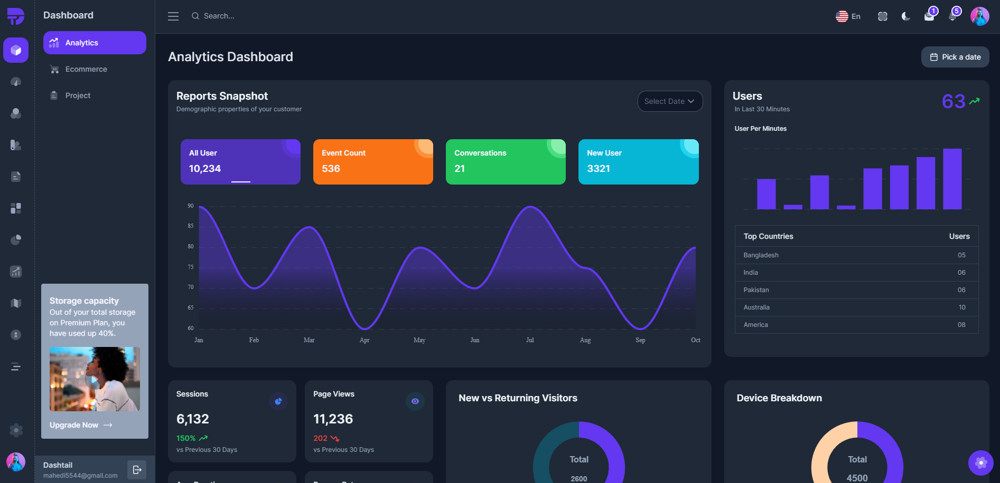
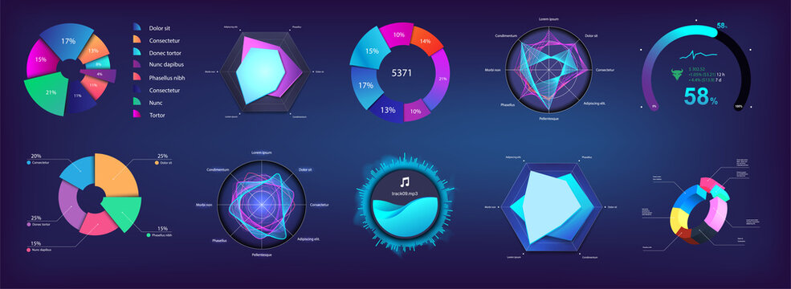

# EduPortal Showcase

### Gave 950+ learners, parents and teachers instant answers about real academic data in plain language — through an AI chatbot serving a live school portal I built and run in production.

🔗 **Live:** [mahlontebe.org.za](https://www.mahlontebe.org.za) · Next.js 16 · Prisma · Auth.js · PostgreSQL · Groq Llama 3.3

---

## 📸 Screenshots

| Portal dashboard | Performance analytics |
|---|---|
|  |  |


> 🎥 **Chatbot demo coming soon** — a short GIF of the assistant answering a real question against live marks data.

---

## Why this repository is a mirror

The production portal is **private**, deliberately. It holds learner names, ID numbers, marks and guardian contact details — publishing it would expose the personal information of minors, which South Africa's **POPIA** and **PAIA** do not permit.

This showcase carries the architecture, patterns and engineering decisions with none of the data. Its sister project [EduAnalytics](https://github.com/machetheDM/edu-analytics-showcase) is mirrored for the same reason.

---

## Author

**Dingaan Mahlatse Machethe**
Head of STEM Department — South African public high school
MSc Data Science (University of East London, UK) | MSc Cybersecurity — Cloud Security Architect (EC-Council University, USA) | PGDip Data Science (Regenesys Business School)

---

## Problem → Technique → Result

### The Problem
Parents, learners, teachers, and administrators at South African public schools have no web portal to access academic performance, attendance, or AI-driven recommendations in real time. Schools cannot afford dedicated development teams or enterprise software licenses. Communication between school and home relies on paper reports sent home with learners — which are frequently lost.

### Techniques Used
- **Full-Stack Architecture:** Next.js 16 App Router with Server Components, TypeScript end-to-end, Prisma ORM with `@prisma/adapter-pg` querying Supabase PostgreSQL
- **Authentication & RBAC:** NextAuth v5 with custom Credentials provider, `bcryptjs` password verification, JWT session strategy, route-level access control via `authorized` callback (Admin/Teacher/Student/Parent)
- **AI Integration:** Vercel AI SDK with Groq `llama-3.3-70b-versatile` — system prompt dynamically injected with live Prisma queries (marks, attendance, APS score, at-risk subjects, career goals). Daily rate limiting tracked in `ChatUsage` table
- **Role-Based AI Personalization:** Student → own marks + attendance + APS; Parent → all linked children's summaries; Teacher → assigned subjects + classes + school-wide stats
- **Serverless Automation:** Vercel Cron with `CRON_SECRET` bearer token — atomically publishes scheduled `News` and `Event` records via `updateMany` where `publishAt <= now()`
- **Database Design:** Prisma schema with NextAuth models + school domain models (Learner, Parent, Teacher, Student, Subject, Mark, Attendance, Prediction, Recommendation, CareerGoal), role-based relations

### The Result
- **Production portal at mahlontebe.org.za** serving 950+ users with role-based dashboards
- **AI chatbot** answers learner-specific questions using real database context — not generic responses, but personalised advice based on actual marks and attendance
- **4-role access system** (Admin/Teacher/Student/Parent) with middleware-enforced route protection — no unauthorised access possible
- **Automated content publishing** — school news and events go live on schedule without manual intervention
- **Integrated ecosystem** — shares learner records with EduAnalytics desktop app via `eaLearnerNumber` bridge key, creating a unified offline + online EdTech platform

---

## What This Is

EduPortal is the cloud-facing web companion to [EduAnalytics](https://github.com/machetheDM/edu-analytics-showcase) (a PySide6 desktop app). While EduAnalytics handles offline data capture, scheduling, and AI diagnostics inside the school, EduPortal extends that data to parents, learners, and administrators via any web browser.

The two systems share the same learner records via the bridge key `eaLearnerNumber` — this is a production-grade integrated EdTech ecosystem, not two isolated projects.

---

## Tech Stack

| Layer | Technology |
|-------|-----------|
| Framework | Next.js 16.2 (App Router) |
| Language | TypeScript 5 |
| Styling | Tailwind CSS 4 + shadcn/ui components |
| Fonts | Inter, Plus Jakarta Sans, JetBrains Mono (Google Fonts) |
| ORM | Prisma 7 + PostgreSQL adapter (`@prisma/adapter-pg`) |
| Database | Supabase PostgreSQL |
| Auth | NextAuth v5 (Auth.js) — Credentials provider with bcrypt |
| AI / LLM | Vercel AI SDK — Groq (`llama-3.3-70b`) + Google Gemini |
| Charts | Recharts |
| Icons | Lucide React |
| Theme | next-themes (dark/light/system) |
| Deployment | Vercel |
| Cron | Vercel Cron + `CRON_SECRET` protected API routes |

---

## Architecture Overview

```
┌─────────────────────────────────────────────────────────────┐
│                        Vercel Edge                          │
│  ┌─────────────┐  ┌─────────────┐  ┌─────────────────────┐  │
│  │   Next.js   │  │   Auth.js   │  │  Vercel AI SDK      │  │
│  │   App Router│  │   (NextAuth)│  │  (Groq / Gemini)    │  │
│  └──────┬──────┘  └──────┬──────┘  └──────────┬──────────┘  │
│         │                │                    │             │
│  ┌──────┴────────────────┴────────────────────┴──────┐      │
│  │              Prisma ORM + PostgreSQL Adapter      │      │
│  └──────────────────────────┬────────────────────────┘      │
│                             │                               │
│                    ┌────────┴────────┐                      │
│                    │  Supabase       │                      │
│                    │  PostgreSQL     │                      │
│                    └─────────────────┘                      │
└─────────────────────────────────────────────────────────────┘
                              │
                              │  eaLearnerNumber bridge
                              │
                    ┌─────────┴──────────┐
                    │   EduAnalytics     │
                    │   (PySide6 +       │
                    │    SQLite local)   │
                    └────────────────────┘
```

---

## Key Modules Showcase

### 1. Role-Based Authentication & Authorization
`auth.ts`, `auth.config.ts` — NextAuth v5 with a custom Credentials provider and JWT session strategy:
- `bcryptjs` password verification against Prisma `User` records
- Role enum: `ADMIN`, `TEACHER`, `STUDENT`, `PARENT`
- Route-level access control via the `authorized` callback: `/admin` → `ADMIN` only, `/teacher` → `TEACHER` or `ADMIN`, `/student` → `STUDENT` or `ADMIN`, `/parent` → `PARENT` or `ADMIN`
- Unauthenticated users are redirected to `/login`; users visiting the wrong role route are redirected to their correct dashboard
- Session augmentation: `id`, `email`, `name`, `image`, `role` all available server-side and client-side

**Skills demonstrated:** NextAuth v5 configuration, JWT strategy, RBAC middleware patterns, TypeScript module augmentation.

---

### 2. AI Chatbot with Live Context Injection
`app/api/chat/route.ts` — Vercel AI SDK-powered chatbot with role-aware, personalised responses:
- **Groq LLM**: `llama-3.3-70b-versatile` via `@ai-sdk/groq`
- **Dynamic system prompt**: Injects the school's full context (subjects, pass types, APS rules, enrolment process)
- **Live user context injection**: Queries Prisma in real-time to fetch the actual logged-in user's marks, attendance, APS score, at-risk subjects, career goals, and recommendations — then appends this to the system prompt so the AI answers using real data
- **Daily rate limit**: 20 messages per user per day, tracked in `ChatUsage` table
- **Role-specific queries**: Student → own marks + attendance + APS; Parent → all linked children's summaries; Teacher → assigned subjects + classes + school-wide stats

**Skills demonstrated:** LLM integration with Vercel AI SDK, prompt engineering, real-time database context injection, rate limiting, Prisma relational queries, role-based AI personalization.

---

### 2b. Retrieval-Augmented "Ask about school policies" (FAISS / Pinecone)
`app/api/policy-chat/route.ts` — a second chat mode with a different honesty contract to the one above:
- **Grounded-only answers**: question → local `all-MiniLM-L6-v2` embedding → vector search (top-k=5) → retrieved extracts injected as the *sole* permitted source → Groq `llama-3.3-70b`
- **Citations**: every answer lists the documents behind it, de-duplicated in first-appearance order
- **Refuses rather than invents**: if retrieval returns nothing, the model is **not called** — the route replies that the documents don't cover it. An unaided LLM would produce a plausible invented school policy, which a parent cannot distinguish from a real one
- **Shared budget**: writes to the same `ChatUsage` row as the live-data chatbot, so alternating modes cannot bypass the daily limit
- **Two interchangeable vector stores** behind one endpoint, selected by `RAG_BACKEND`: self-hosted **FAISS** (`IndexFlatIP`, exact, in-process, free) or managed **Pinecone** (serverless, free Starter tier). Same corpus, same chunker, same embeddings — the store is the only variable
- **Fail-closed data residency control**: Pinecone ingest refuses to run without an explicit per-document allowlist, and a deny-list blocks exam registers and raw-mark exports regardless. Those documents contain learner names; uploading them to `us-east-1` would be a POPIA cross-border transfer of minors' personal information, and deleting the index afterwards would not undo it

The full trade-off analysis is in [`docs/vector-db-comparison.md`](docs/vector-db-comparison.md). Its conclusion runs against the direction the work started in: **at this corpus size FAISS is the better engine on both recall and latency**, and Pinecone is implemented and switchable rather than adopted.

**Skills demonstrated:** RAG architecture, embedding models, vector similarity search, exact vs approximate index trade-offs, LLM grounding and refusal design, POPIA/data-residency controls, fail-closed security design, comparative technology evaluation.

---

### 3. Prisma ORM + PostgreSQL
`prisma/schema.prisma` — Production-grade schema with:
- NextAuth-compatible models: `User`, `Account`, `Session`, `VerificationToken`
- School domain models: `Learner`, `Parent`, `Teacher`, `Student`, `Subject`, `Mark`, `Attendance`, `Prediction`, `Recommendation`, `CareerGoal`, `News`, `Event`
- Role-based relations: `Teacher` → `SubjectTeacher[]`, `ClassTeacher[]`; `Parent` → `Learner[]`
- Prisma Client generated to `src/generated/prisma` for tree-shaking

`lib/prisma.ts` — Singleton PrismaClient with PostgreSQL adapter, global caching in development, query logging toggle.

**Skills demonstrated:** Prisma schema design, relational modelling, PostgreSQL adapter configuration, singleton pattern for serverless environments.

---

### 4. Scheduled Content Publishing (Vercel Cron)
`app/api/cron/publish/route.ts` — Protected cron endpoint:
- `CRON_SECRET` header validation (401 if missing/invalid)
- Atomically publishes `News` and `Event` records where `publishAt <= now()` and `published = false`
- Returns JSON with counts: `{ newsPublished: N, eventsPublished: M }`

**Skills demonstrated:** Serverless cron jobs, secret-based API protection, atomic batch updates, time-based publishing.

---

### 4b. The same job on Azure Functions (serverless, cross-cloud)
`azure-functions/publish-scheduler/` — the publishing job reimplemented as a Python timer-triggered Azure Function, running alongside the Vercel cron rather than replacing it:
- **Consumption (serverless) plan** — 1M executions/month on a permanent free grant, not a trial
- **Secrets via managed identity**: the database connection string is a Key Vault *reference* resolved by the host before the worker starts, so the deployment configuration holds a URI and never a credential
- **No inbound network surface**: a timer trigger has no HTTP endpoint, so unlike the cron route it cannot be called by anyone
- **Application Insights**: structured `custom_dimensions` promoted to queryable KQL columns
- **Safe to run both**: each statement matches only `published = false` rows, so whichever scheduler runs second matches nothing. The Vercel cron stays as a fallback until the Azure timer is proven
- **Testable without Azure**: the SQL lives in a module importing only the standard library, so 18 tests run with no database, no driver and no Azure SDK

**On cost, accurately:** executions fall inside the permanent free grant, but a Function App *requires* a storage account, which has no free allowance, and Key Vault bills per operation. Both amount to cents a month — it is not $0.00, and the README says so rather than repeating the marketing number.

A comparison against the AWS Lambda in the Rams @Elec project — packaging, secrets, cold start, pricing, local tooling — is in [`docs/serverless-comparison.md`](docs/serverless-comparison.md).

**Skills demonstrated:** Azure Functions, serverless timer triggers, managed identity, Key Vault secret references, Application Insights/KQL, cross-cloud comparison, dependency-free unit testing, idempotent migration strategy.

---

### 5. Responsive Marketing Landing Page
`app/page.tsx` — Full-featured public homepage:
- Server-rendered with `dynamic = "force-dynamic"`
- Hero section with stats (enrolled learners, staff, pass rate)
- Feature cards: Performance Tracking, ML Predictions, AI Recommendations, Role-Based Access
- Role portal entry points (Parent / Learner / Teacher / Admin)
- News & events carousel with Unsplash images
- Events carousel with date formatting
- Scroll-reveal animations
- Dark mode compatible via Tailwind + next-themes

**Skills demonstrated:** Next.js App Router server components, responsive design with Tailwind, dark mode theming, component composition, marketing page architecture.

---

### 6. Application Shell & Theming
`app/layout.tsx` — Root layout with:
- Three Google Fonts (Inter, Plus Jakarta Sans, JetBrains Mono) as CSS variables
- `suppressHydrationWarning` for next-themes compatibility
- `ThemeProvider` wrapper for dark/light/system mode
- `NextAuthProvider` for session context
- Global `AnnouncementBanner` (server-fetched)
- Global `ChatbotWidget` (floating AI assistant on every page)

**Skills demonstrated:** Next.js root layout patterns, font optimization, theme management, global context providers, hydration safety.

---

## What This Project Demonstrates

### Full-Stack Web Development
- Next.js 16 App Router with Server Components
- TypeScript end-to-end (API routes, components, database models)
- Prisma ORM with relational database design
- RESTful API design inside Next.js (`app/api/*` route handlers)
- Serverless cron jobs

### AI & LLM Integration
- Vercel AI SDK for streaming/non-streaming text generation
- Dynamic prompt engineering with live database context
- Multi-provider AI architecture (Groq + Google Gemini in the same codebase)
- Rate-limited AI endpoints with usage tracking

### Authentication & Security
- NextAuth v5 with custom credentials provider
- Password hashing with bcryptjs
- JWT session strategy
- Role-based route protection at the middleware/callback level
- Cron endpoint protection with bearer token secrets

### Cloud & DevOps
- Supabase PostgreSQL as managed cloud database
- Vercel serverless deployment
- Environment-variable-only configuration (no secrets in code)
- Prisma generate as post-install hook for CI/CD

---

## Screenshots

See the [`screenshots/`](screenshots/) directory for UI previews of the portal.

---

## Related Projects

- **[EduAnalytics Showcase](https://github.com/machetheDM/edu-analytics-showcase)** — PySide6 desktop app with ML clustering, predictive modelling, FastAPI, and Docker
- **[Production EduPortal](https://www.mahlontebe.org.za)** — Live site (private repository)

---

## License

This showcase is provided for portfolio and educational purposes. The production system and its data remain private.

---

*Built by Dingaan Mahlatse Machethe — transitioning from Education to Tech.*
